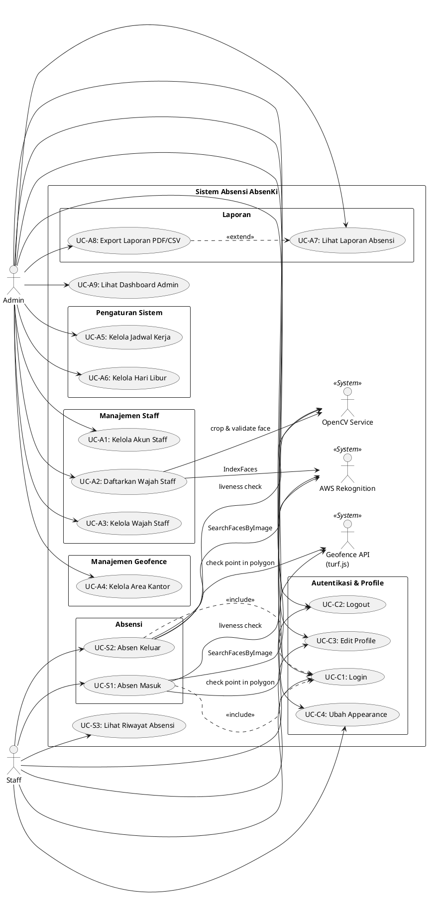

# Use Case Diagram - Sistem Absensi AbsenKi

## Deskripsi Sistem

Sistem absensi berbasis geolokasi dan pengenalan wajah yang menggunakan teknologi geofencing, OpenCV (liveness detection), dan AWS Rekognition untuk verifikasi identitas staff.

---

## Aktor

### 1. Admin

Administrator sistem yang mengelola data staff, geofence, dan laporan.

### 2. Staff

Karyawan yang melakukan absensi masuk dan keluar.

---

## Use Cases

### **Admin Use Cases**

#### A. Manajemen Staff

-   **UC-A1: Kelola Akun Staff**

    -   Deskripsi: Admin dapat membuat, melihat, mengedit, dan menghapus akun staff
    -   Aktor: Admin
    -   Precondition: Admin sudah login
    -   Postcondition: Data staff tersimpan di sistem

-   **UC-A2: Daftarkan Wajah Staff**

    -   Deskripsi: Admin mengunggah 3-5 foto wajah staff untuk pendaftaran face recognition
    -   Aktor: Admin
    -   Precondition: Staff sudah terdaftar di sistem
    -   Flow:
        1. Admin pilih staff
        2. Upload 3-5 foto wajah dari berbagai sudut
        3. OpenCV proses dan crop wajah
        4. AWS Rekognition index wajah dan simpan FaceId
    -   Postcondition: Wajah staff terdaftar di sistem dan AWS Collection

-   **UC-A3: Kelola Wajah Staff**
    -   Deskripsi: Admin dapat melihat dan menghapus profil wajah staff yang sudah terdaftar
    -   Aktor: Admin
    -   Precondition: Staff memiliki profil wajah
    -   Postcondition: Profil wajah diperbarui

#### B. Manajemen Geofence

-   **UC-A4: Kelola Area Kantor (Geofence)**
    -   Deskripsi: Admin mendefinisikan area kantor menggunakan polygon geofence
    -   Aktor: Admin
    -   Precondition: Admin sudah login
    -   Flow:
        1. Admin buat/edit geofence dengan menandai polygon di peta
        2. Simpan koordinat polygon dalam format GeoJSON
        3. Aktifkan/nonaktifkan geofence
    -   Postcondition: Area kantor terdefinisi dan aktif

#### C. Pengaturan Sistem

-   **UC-A5: Kelola Jadwal Kerja**

    -   Deskripsi: Admin mengatur jam kerja dan shift
    -   Aktor: Admin
    -   Precondition: Admin sudah login
    -   Postcondition: Jadwal kerja tersimpan

-   **UC-A6: Kelola Hari Libur**
    -   Deskripsi: Admin menentukan tanggal libur nasional/kantor
    -   Aktor: Admin
    -   Precondition: Admin sudah login
    -   Postcondition: Data hari libur tersimpan

#### D. Laporan

-   **UC-A7: Lihat Laporan Absensi**

    -   Deskripsi: Admin melihat laporan absensi dengan filter tanggal dan staff
    -   Aktor: Admin
    -   Precondition: Ada data absensi
    -   Postcondition: Laporan ditampilkan

-   **UC-A8: Export Laporan (PDF/CSV)**
    -   Deskripsi: Admin mengunduh laporan dalam format PDF atau CSV
    -   Aktor: Admin
    -   Extend from: UC-A7
    -   Postcondition: File laporan terunduh

#### E. Dashboard

-   **UC-A9: Lihat Dashboard Admin**
    -   Deskripsi: Admin melihat ringkasan statistik absensi
    -   Aktor: Admin
    -   Postcondition: Dashboard menampilkan data ringkasan

---

### **Staff Use Cases**

#### A. Absensi

-   **UC-S1: Absen Masuk**

    -   Deskripsi: Staff melakukan absensi masuk dengan verifikasi wajah dan lokasi
    -   Aktor: Staff
    -   Precondition:
        -   Staff sudah login
        -   Wajah staff sudah terdaftar
        -   Browser memiliki akses kamera dan GPS
    -   Main Flow:
        1. Staff membuka halaman absen
        2. Sistem meminta izin kamera dan lokasi
        3. Staff mengambil foto selfie
        4. Sistem verifikasi lokasi dengan geofence (turf.js)
        5. OpenCV deteksi wajah dan liveness check
        6. Crop wajah dikirim ke AWS Rekognition SearchFacesByImage
        7. AWS mengembalikan similarity score dan FaceId
        8. Sistem validasi:
            - Similarity >= threshold (misal 80%)
            - FaceId cocok dengan user login
            - Lokasi di dalam geofence aktif
        9. Jika valid, catat absensi masuk
    -   Postcondition: Data absensi masuk tersimpan
    -   Alternate Flow:
        -   Wajah tidak terdeteksi → Minta ulang
        -   Similarity rendah → Absensi ditolak
        -   Di luar geofence → Absensi ditolak

-   **UC-S2: Absen Keluar**
    -   Deskripsi: Staff melakukan absensi keluar dengan verifikasi wajah dan lokasi
    -   Aktor: Staff
    -   Precondition: Staff sudah absen masuk hari ini
    -   Flow: Sama dengan UC-S1
    -   Postcondition: Data absensi keluar tersimpan

#### B. Riwayat

-   **UC-S3: Lihat Riwayat Absensi**
    -   Deskripsi: Staff melihat riwayat absensi pribadi
    -   Aktor: Staff
    -   Precondition: Staff sudah login
    -   Postcondition: Riwayat absensi ditampilkan

---

### **Common Use Cases (Admin & Staff)**

-   **UC-C1: Login**

    -   Deskripsi: User login ke sistem
    -   Aktor: Admin, Staff
    -   Postcondition: User berhasil login dan diarahkan ke dashboard sesuai role

-   **UC-C2: Logout**

    -   Deskripsi: User keluar dari sistem
    -   Aktor: Admin, Staff
    -   Postcondition: Session berakhir

-   **UC-C3: Edit Profile**

    -   Deskripsi: User mengedit informasi profil pribadi
    -   Aktor: Admin, Staff
    -   Precondition: User sudah login
    -   Postcondition: Data profil diperbarui

-   **UC-C4: Ubah Appearance/Theme**
    -   Deskripsi: User mengubah tema tampilan aplikasi
    -   Aktor: Admin, Staff
    -   Precondition: User sudah login
    -   Postcondition: Preferensi tema tersimpan

---

## Use Case Diagram (PlantUML)



---

## Use Case Diagram (Mermaid)

```mermaid
graph TB
    Admin((Admin))
    Staff((Staff))
    AWS[AWS Rekognition]
    OpenCV[OpenCV Service]
    Geo[Geofence turf.js]

    subgraph "Sistem Absensi AbsenKi"
        subgraph "Manajemen Staff"
            UC_A1[UC-A1: Kelola Akun Staff]
            UC_A2[UC-A2: Daftarkan Wajah Staff]
            UC_A3[UC-A3: Kelola Wajah Staff]
        end

        subgraph "Manajemen Geofence"
            UC_A4[UC-A4: Kelola Area Kantor]
        end

        subgraph "Pengaturan"
            UC_A5[UC-A5: Kelola Jadwal Kerja]
            UC_A6[UC-A6: Kelola Hari Libur]
        end

        subgraph "Laporan"
            UC_A7[UC-A7: Lihat Laporan]
            UC_A8[UC-A8: Export PDF/CSV]
        end

        UC_A9[UC-A9: Dashboard Admin]

        subgraph "Absensi"
            UC_S1[UC-S1: Absen Masuk]
            UC_S2[UC-S2: Absen Keluar]
        end

        UC_S3[UC-S3: Riwayat Absensi]

        subgraph "Common"
            UC_C1[UC-C1: Login]
            UC_C2[UC-C2: Logout]
            UC_C3[UC-C3: Edit Profile]
            UC_C4[UC-C4: Ubah Appearance]
        end
    end

    Admin --> UC_A1
    Admin --> UC_A2
    Admin --> UC_A3
    Admin --> UC_A4
    Admin --> UC_A5
    Admin --> UC_A6
    Admin --> UC_A7
    Admin --> UC_A8
    Admin --> UC_A9
    Admin --> UC_C1
    Admin --> UC_C2
    Admin --> UC_C3
    Admin --> UC_C4

    Staff --> UC_S1
    Staff --> UC_S2
    Staff --> UC_S3
    Staff --> UC_C1
    Staff --> UC_C2
    Staff --> UC_C3
    Staff --> UC_C4

    UC_A2 -.-> OpenCV
    UC_A2 -.-> AWS
    UC_S1 -.-> OpenCV
    UC_S1 -.-> AWS
    UC_S1 -.-> Geo
    UC_S2 -.-> OpenCV
    UC_S2 -.-> AWS
    UC_S2 -.-> Geo
    UC_A8 -.extend.-> UC_A7
```



---

## Prioritas Use Case (MVP)

### High Priority (P0 - Must Have)

1. UC-C1: Login
2. UC-A1: Kelola Akun Staff
3. UC-A2: Daftarkan Wajah Staff
4. UC-A4: Kelola Area Kantor (Geofence)
5. UC-S1: Absen Masuk
6. UC-S2: Absen Keluar
7. UC-S3: Lihat Riwayat Absensi

### Medium Priority (P1 - Should Have)

8. UC-A7: Lihat Laporan Absensi
9. UC-A9: Lihat Dashboard Admin
10. UC-A3: Kelola Wajah Staff
11. UC-C3: Edit Profile

### Low Priority (P2 - Nice to Have)

12. UC-A8: Export Laporan PDF/CSV
13. UC-A5: Kelola Jadwal Kerja
14. UC-A6: Kelola Hari Libur
15. UC-C4: Ubah Appearance

---

## Validasi & Aturan Bisnis

### Aturan Absensi

1. Staff hanya bisa absen jika:
    - Lokasi berada di dalam geofence aktif
    - Wajah terdeteksi dengan liveness check (OpenCV)
    - Similarity dengan AWS Rekognition >= 80%
    - FaceId cocok dengan user yang login
2. Staff tidak bisa absen keluar sebelum absen masuk

3. Staff hanya bisa absen masuk/keluar 1x per hari

### Aturan Geofence

1. Hanya bisa ada 1 geofence aktif pada satu waktu
2. Geofence harus berbentuk polygon (minimal 3 titik koordinat)

### Aturan Pendaftaran Wajah

1. Minimal 3 foto, maksimal 5 foto per staff
2. Setiap foto harus berisi 1 wajah yang jelas
3. Foto harus lulus validasi OpenCV (deteksi wajah, quality check)

---

## Teknologi yang Digunakan

-   **Backend**: Laravel 12 + Livewire/Volt
-   **Frontend**: Blade + Tailwind CSS
-   **Face Recognition**: AWS Rekognition (IndexFaces, SearchFacesByImage)
-   **Computer Vision**: OpenCV (Python service untuk liveness detection & face crop)
-   **Geofencing**: turf.js (booleanPointInPolygon)
-   **Database**: MySQL
-   **Build Tool**: Vite

---

## Catatan Implementasi

1. **Security**:
    - HTTPS wajib untuk akses kamera & GPS
    - IAM user AWS dengan akses terbatas hanya Rekognition
2. **Privacy**:

    - Foto asli tidak disimpan ke AWS S3
    - Hanya crop wajah (bytes) yang dikirim ke AWS
    - FaceId disimpan di database, bukan foto asli

3. **Performance**:

    - Geofence validation di client-side (turf.js) untuk response cepat
    - Optional server-side validation untuk keamanan

4. **Browser Requirement**:
    - Support getUserMedia API (kamera)
    - Support Geolocation API (GPS)
    - Modern browser (Chrome, Firefox, Safari, Edge)

---

## Diagram Dapat Divisualisasikan Dengan:

1. **PlantUML**: Copy kode PlantUML di atas ke https://plantuml.com/
2. **Mermaid**: Copy kode Mermaid ke https://mermaid.live/
3. **Draw.io / Lucidchart**: Import atau gambar manual berdasarkan deskripsi use case

---

Dibuat: 13 Desember 2025

```

```
